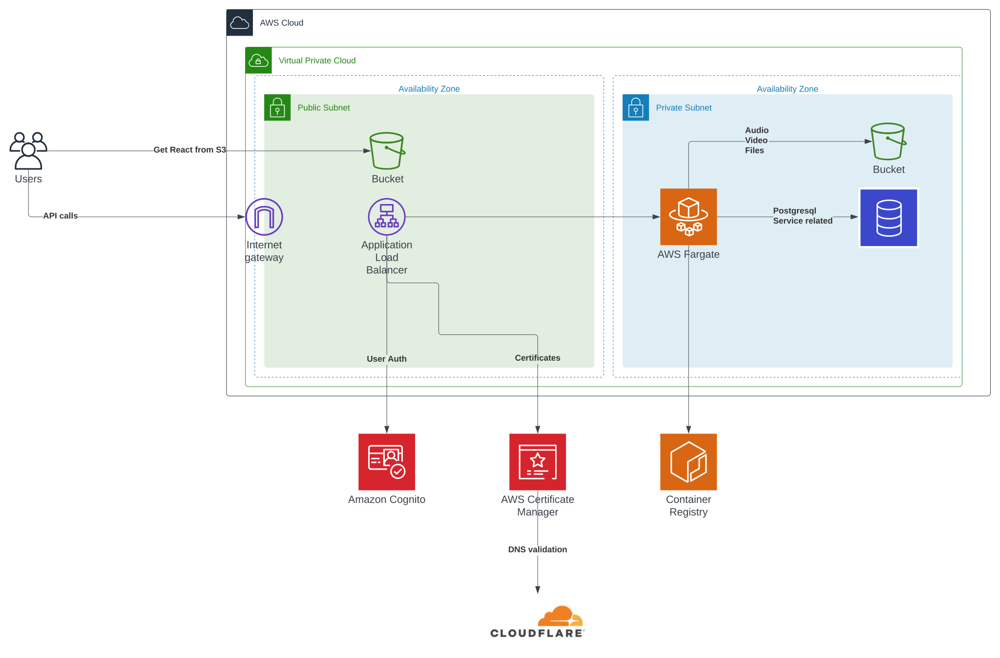

# DevOps 🚀

Our terraform infrastructure. This is the main source of all infrastructue used by voxtir, but outside of this exists a couple of things
* A bucket not maintained here to store the terraform states
* The AWS organization used to structure everything
* Actual accounts and users

**Accounts:** (not in use)
Currently there exists three accounts
* The root account maintained by Gustav Hartz
  * Owns the state bucket
* The staging account
  * Owns the staging related resources
  * Owns CI/CD as there is no CD on production. This is done manually
* The production account *(In progress)*
  * Owns the production related resources

## Getting started
```
#Install aws cli and auth
#Install Terraform CLI
# cd to appropriate folder
$ terraform init
$ terraform apply
```


We have the domain in a separate service, because seems like good pratice to keep that somewhere external


## About

With terraform it allow us to do infrastructure-as-code. Terraform allows us to
plan changes and ensure consistentcy between different environment, avoiding
manual setup which helps with avoiding mistakes while configuring.

By having the code in Git, it allows us to track and understand changes that
has been made in our cloud.

It also allows other team members to make a pull request with changes they want
to make without having access, when accepted being performed by a person with
access. That can be anything from performance increases, firewall changes
to additional user access.

## TODO
[ ] Validate that it works with an appropriate container
[ ] Include CI/CD in the project on the repo

## Initial infrastructure plan


## Inspiration links
[link1](https://github.com/no10ds/rapid-infrastructure/blob/1126fbbf3887fe231fc4b5106738842f9927d0a9/modules/app-cluster/main.tf)
[link2](https://github.com/hashicorp/terraform-aws-consul-ecs/blob/e6c6425120fdb09e842f5a6268ed6b1473a8925c/examples/dev-server-fargate/main.tf#L42)
[Main link - same architecture ish](https://www.tecracer.com/blog/2020/03/building-a-fargate-based-container-app-with-cognito-authentication.html)

# TODO
There can be some issues with the ordering on initial deploy, but running the apply twice should solve it :)